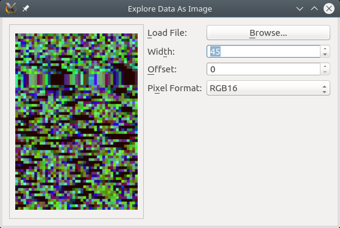

Pixmap Prober
=============

Pixmap Prober is a simple little PyQt hack for looking for patterns in binary
data when rendered as an image, to complement looking for patterns in a hex
editor.

Since it's a quick hack that I wrote because I got nerd-sniped, I probably
won't implement any additional features, but I'll fix bugs if I have time to
spare.

Usage
-----

Install Python 3.x and PyQt 5, then run ``pixmap_prober.py``.

Development
-----------

To regenerate ``mainwin.py`` from ``mainwin.ui`` run the following command::

    pyuic5 mainwin.ui > mainwin.py
